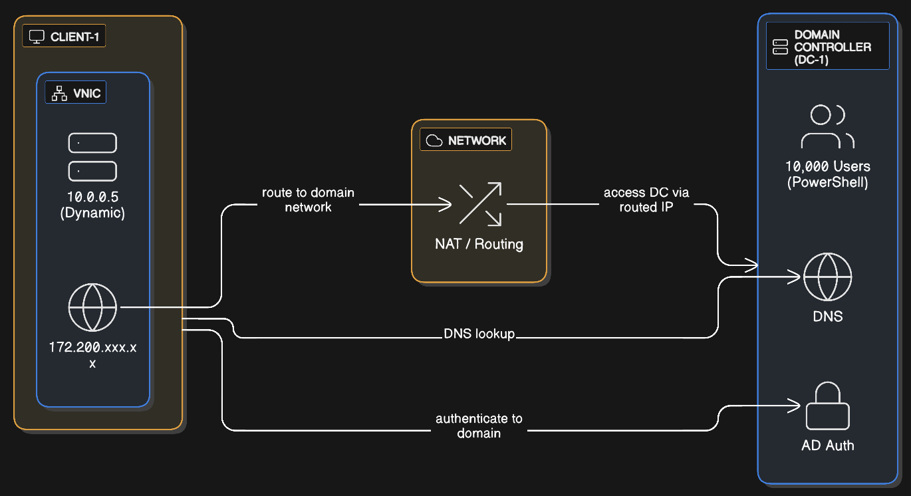
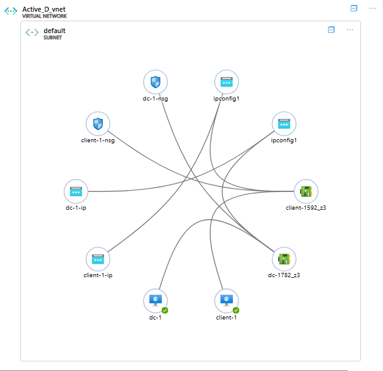
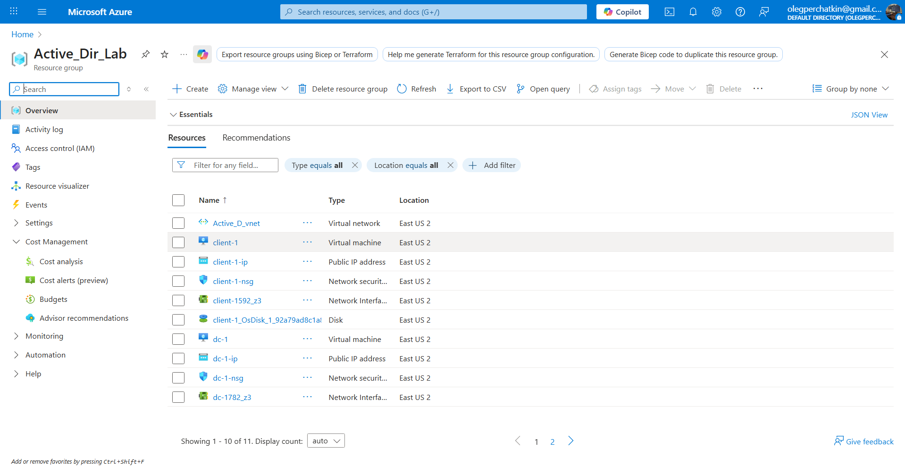
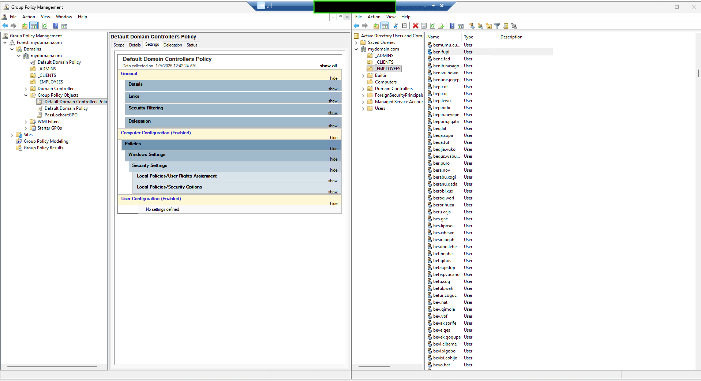
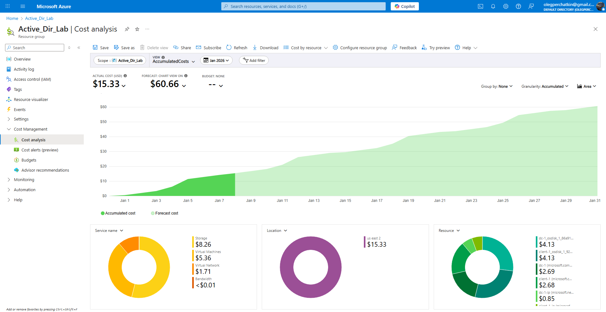
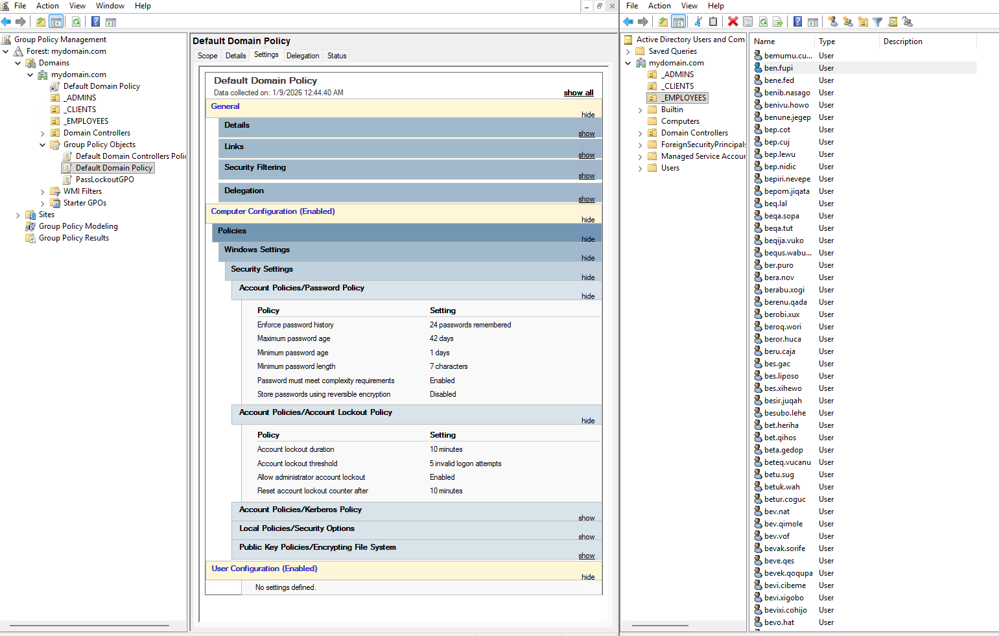

# Active Directory Azure Lab



   

---

## Overview
This lab demonstrates an enterprise-style Active Directory deployment inside Azure. It walks through provisioning the Active_Dir_Lab resource group in East US 2, configuring networking for Active_D_vnet, promoting dc-1 to a domain controller for mydomain.com, joining client-1, and automating the creation of 10,000 lab identities. The project captures real cost data, Group Policy enforcement, and screenshots that prove every milestone.

---

## Lab Specifications
**Infrastructure**
- Resource group: `Active_Dir_Lab` (region: East US 2)
- Virtual network: `Active_D_vnet` (address space: 10.0.0.0/24)
- Domain controller: `dc-1` (Windows Server 2022 Datacenter)
- Client workstation: `client-1` (Windows 11 Enterprise)
- Domain name: `mydomain.com`

**Active Directory**
- Forest/domain functional level: Windows Server 2016
- Organizational units: `_ADMINS`, `_CLIENTS`, `_EMPLOYEES`
- Bulk identities: **10,000** randomized users created with PowerShell
- DNS: Hosted on `dc-1`

**Security Configuration**
- Account lockout threshold: **5** invalid logon attempts
- Lockout duration: **10 minutes**; counter resets after **10 minutes**
- Password policy: Minimum **7 characters**, complexity required, **42-day** expiration
- Network Security Groups: `dc-1-nsg`, `client-1-nsg` restrict RDP and allow intra-subnet traffic

**Networking**
- `client-1` dynamic private IP: 10.0.0.5 (DHCP)
- `dc-1` private IP: dynamically assigned within `Active_D_vnet`
- Public IPs: `dc-1-ip`, `client-1-ip` for management access
- NAT and routing allow private communication while exposing managed public IPs for remote administration

---

## Lab Architecture
<p align="center">
  
</p>

- `client-1` connects over RDP or VNC, receives a dynamic IP on `Active_D_vnet`, and forwards DNS queries to `dc-1`.
- Azure NAT and routing enable `client-1` to reach `dc-1` over private addressing while exposing controlled public entry points.
- `dc-1` hosts both DNS and Active Directory Domain Services, authenticating the 10,000 generated users.
- Authentication flow: `client-1` -> DNS lookup on `dc-1` -> Kerberos or LDAP authentication -> domain access.

---

## Azure Infrastructure


Provisioned resources inside `Active_Dir_Lab`:
- Virtual network: `Active_D_vnet` with `default` subnet
- Virtual machines: `dc-1`, `client-1`
- Network interfaces: `dc-1782_z3`, `client-1592_z3`
- Public IPs: `dc-1-ip`, `client-1-ip`
- Network security groups: `dc-1-nsg`, `client-1-nsg`
- Managed disks: `dc-1` OS disk, `client-1_OsDisk`

---

## PowerShell User Creation


- PowerShell script `scripts/Create-BulkUsers.ps1` provisions **10,000** unique lab identities.
- Accounts reside in the `_EMPLOYEES` OU alongside `_ADMINS` and `_CLIENTS` containers.
- Sample names (`bemumu.cu`, `ben.fupi`, `bes.qlipo`) confirm randomized generation.

The complete script is included below so you can review the safeguards (module validation, OU existence checks, duplicate handling) before running it in your own environment.

```powershell
<#
.SYNOPSIS
  Bulk Active Directory User Creation Script
.DESCRIPTION
  Creates multiple test user accounts in Active Directory with random names.
  Useful for lab environments and testing Group Policy, permissions, or logon behavior.
.NOTES
  Author: Oleg Perchatkin
  Version: 1.0
  Requires: Active Directory PowerShell Module
.EXAMPLE
  .\Create-BulkUsers.ps1
#>

[CmdletBinding()]
param (
  [Parameter(Mandatory = $false)]
  [ValidateRange(1,1000)]
  [int]$NumberOfAccountsToCreate = 25,

  [Parameter(Mandatory = $false)]
  [string]$PasswordForUsers = "P@ssw0rd123!",

  [Parameter(Mandatory = $false)]
  [string]$TargetOu = "OU=_EMPLOYEES,DC=mydomain,DC=com"
)

# region Validate environment
try {
  Import-Module ActiveDirectory -ErrorAction Stop
}
catch {
  Write-Error "Active Directory module not available. Install RSAT: Active Directory Domain Services Tools before running this script.";
  return
}

if (-not (Get-ADOrganizationalUnit -Filter "DistinguishedName -eq '$TargetOu'" -ErrorAction SilentlyContinue)) {
  Write-Error "Target OU '$TargetOu' not found. Create it before running the script.";
  return
}
# endregion

# Convert the plain text password to a secure string for New-ADUser.
$securePassword = ConvertTo-SecureString -String $PasswordForUsers -AsPlainText -Force

# Helper function creates names that look realistic enough for lab demos.
function New-RandomName {
  [OutputType([pscustomobject])]
  param ()

  $consonants = "bcdfghjklmnpqrstvwxyz".ToCharArray()
  $vowels = "aeiou".ToCharArray()

  function Get-Syllable([int]$length) {
    $name = ""
    for ($i = 0; $i -lt $length; $i++) {
      $name += $consonants[(Get-Random -Minimum 0 -Maximum $consonants.Length)]
      $name += $vowels[(Get-Random -Minimum 0 -Maximum $vowels.Length)]
    }
    return ($name.Substring(0,1).ToUpper() + $name.Substring(1))
  }

  $first = Get-Syllable -length (Get-Random -Minimum 2 -Maximum 3)
  $last = Get-Syllable -length (Get-Random -Minimum 2 -Maximum 3)

  return [pscustomobject]@{
    GivenName = $first
    Surname   = $last
  }
}

# Track successes for a concise summary.
$createdUsers = @()

for ($i = 1; $i -le $NumberOfAccountsToCreate; $i++) {
  $name = New-RandomName
  $givenName = $name.GivenName
  $surname = $name.Surname

  $samAccountName = ("{0}.{1}" -f $givenName, $surname).ToLower()
  $userPrincipalName = "{0}@{1}" -f $samAccountName, ((Get-ADDomain).DNSRoot)

  # Ensure username uniqueness by appending a counter if necessary.
  $samCandidate = $samAccountName
  $counter = 1
  while (Get-ADUser -Filter "SamAccountName -eq '$samCandidate'" -ErrorAction SilentlyContinue) {
    $samCandidate = "{0}{1}" -f $samAccountName, $counter
    $userPrincipalName = "{0}@{1}" -f $samCandidate, ((Get-ADDomain).DNSRoot)
    $counter++
  }

  $parameters = @{
    Name                  = ("{0} {1}" -f $givenName, $surname)
    GivenName             = $givenName
    Surname               = $surname
    SamAccountName        = $samCandidate
    UserPrincipalName     = $userPrincipalName
    DisplayName           = ("{0} {1}" -f $givenName, $surname)
    EmployeeID            = (Get-Random -Minimum 100000 -Maximum 999999).ToString()
    AccountPassword       = $securePassword
    Enabled               = $true
    PasswordNeverExpires  = $true
    Path                  = $TargetOu
    ChangePasswordAtLogon = $false
  }

  try {
    New-ADUser @parameters
    Write-Host "Created user: $($parameters.SamAccountName)" -ForegroundColor Green
    $createdUsers += $parameters.SamAccountName
  }
  catch {
    Write-Warning "Failed to create user '$($parameters.SamAccountName)': $_"
  }
}

Write-Host "Completed. Created $($createdUsers.Count) of $NumberOfAccountsToCreate requested accounts." -ForegroundColor Cyan

# Optional: list the first few accounts created for quick review.
$createdUsers | Select-Object -First 5 | ForEach-Object { Write-Host "Sample account: $_" -ForegroundColor Yellow }
```

> Tip: Supply `-NumberOfAccountsToCreate 10000` when you run the script to mirror the reference lab scale; the default of 25 keeps quick smoke tests fast.

Example execution on `dc-1` after cloning the repository:
```powershell
cd C:\active-directory-azure-lab\scripts
Unblock-File .\Create-BulkUsers.ps1
./Create-BulkUsers.ps1 -UserCount 10000 -TargetOU "OU=_EMPLOYEES,DC=mydomain,DC=com"
```
(Parameters shown align the run with the 10,000-user reference; adjust values as needed for your own lab.)

---

## Group Policy Configuration


- Account lockout threshold: **5** invalid logon attempts
- Account lockout duration: **10 minutes**
- Reset counter after: **10 minutes**
- Complementary password policy: complexity required, 7-character minimum, 42-day maximum password age
- Policy linked at the domain level to cover `_EMPLOYEES`, `_CLIENTS`, and `_ADMINS`

---

## Cost Management


**Actual lab costs (January 2026)**
- Total spent to date: **$15.33 USD**
- Monthly forecast if left running: **$60.66 USD**
- Cost breakdown: Storage **$8.26**, Virtual Machines **$5.36**, Virtual Network **$1.71**, Bandwidth **< $0.01**

**Cost-saving tips**
1. Stop (deallocate) `dc-1` and `client-1` whenever the lab is idle to pay only for storage.
2. Set Azure Cost Management alerts at **$20**, **$40**, and **$60** thresholds.
3. Delete the `Active_Dir_Lab` resource group after exporting evidence to reset spending to **$0**.
4. Monitor **Cost Management -> Cost analysis** for daily charge trends.

---

## Skills Demonstrated
- Azure resource group, virtual network, and network security group configuration
- Windows Server 2022 Active Directory Domain Services deployment
- PowerShell automation for high-volume identity provisioning (10,000 accounts)
- Group Policy design for account lockout and password enforcement
- DNS troubleshooting across domain-joined Windows clients
- Azure cost tracking and optimization

---

## Prerequisites
- Azure subscription (free tier credits work)
- RDP client for Windows, macOS, or Linux
- Familiarity with Windows Server administration and Active Directory fundamentals
- PowerShell 7.4 or later for automation steps

---

## Quick Start Guide
```powershell
# Clone the repository
git clone https://github.com/arthurperch/active-directory-azure-lab.git
cd active-directory-azure-lab

# Work through the setup guides
code docs/01-Azure-Setup.md

# After deploying dc-1 and promoting it to a domain controller
cd scripts
./Create-BulkUsers.ps1

# The script creates 10,000 randomized users in the _EMPLOYEES OU
```

---

## Documentation Roadmap
| Phase | Guide | What You Complete |
| --- | --- | --- |
| 01 | [Azure Setup](docs/01-Azure-Setup.md) | Create `Active_Dir_Lab`, configure `Active_D_vnet`, subnet, and NSG guardrails |
| 02 | [Deploy Domain Controller](docs/02-Deploy-Domain-Controller.md) | Provision `dc-1`, install AD DS, and promote it for `mydomain.com` |
| 03 | [Deploy Client VM](docs/03-Deploy-Client-VM.md) | Build `client-1`, point DNS to `dc-1`, and join it to the domain |
| 04 | [Create 10,000 Users](docs/04-Creating-Users-PowerShell.md) | Run automation to populate `_EMPLOYEES` with 10,000 accounts |
| 05 | [Group Policy Security](docs/05-Group-Policy-Management.md) | Configure the 5-attempt account lockout and validate enforcement |
| 06 | [Validation & Testing](docs/06-Testing-and-Validation.md) | Verify DNS, authentication, and GPO application end-to-end |
| 07 | [Cost Management](docs/07-Cleanup-and-Cost-Management.md) | Track Azure spend, deallocate resources, and clean up the lab |
| Support | [Troubleshooting Guide](docs/Troubleshooting.md) | Resolve RDP, DNS, domain join, PowerShell, and GPO issues |

---

## Visual Evidence

<table>
  <tr>
    <td>
      
      <p align="center">Lab topology and authentication flow</p>
    </td>
    <td>
      
      <p align="center">Active_D_vnet with dc-1 and client-1</p>
    </td>
    <td>
      
      <p align="center">Active_Dir_Lab resource inventory</p>
    </td>
  </tr>
  <tr>
    <td>
      
      <p align="center">Bulk user automation running on dc-1</p>
    </td>
    <td>
      
      <p align="center">10,000 accounts inside _EMPLOYEES OU</p>
    </td>
    <td>
      
      <p align="center">Default Domain Policy enforcing lockout controls</p>
    </td>
  </tr>
  <tr>
    <td colspan="3">
      
      <p align="center">January 2026 spend vs forecast</p>
    </td>
  </tr>
</table>

> All PNG evidence lives in the screenshots/ directory so you can drop in updated captures without changing links.

---

## Additional Resources
- `scripts/Create-BulkUsers.ps1`: PowerShell automation for identity generation
- `scripts/Test-ADConfiguration.ps1`: Optional health validation script
- [docs/Troubleshooting.md](docs/Troubleshooting.md): Step-by-step fixes for common issues

---

## Contributing
Fork the repository, open an issue describing the enhancement or fix, and submit a pull request with before-and-after screenshots when applicable. Keep documentation beginner-friendly and note any subscription costs associated with new features.

---

## License
Distributed under the MIT License. See [LICENSE](LICENSE) for details.

